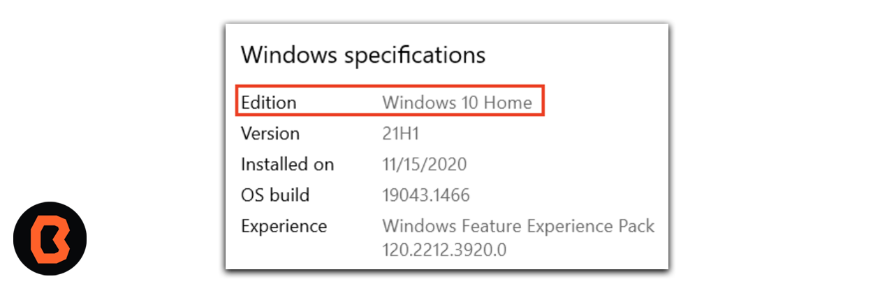

# Sesión 02 - Instrucciones para Instalar Android Studio

Antes de comenzar recuerda que estos son los requisitos minimos para una correcta instalación.

## Pilares del Pensamiento Lógico Computacional

El pensamiento lógico computacional es una habilidad mental que nos permite analizar y resolver problemas de manera sistemática y lógica, este pensamiento tiene cuatro pilares fundamentales.

## Requisitos del sistema para Android Studio

Conocer los pilares del pensamiento lógico computacional que nos permitirá resolver de problemas de nuestra vida cotidiana y llevar esta lógica de resolución de problemas al mundo digital, los pilares son los siguientes: 

1. Descomposición: 
    - Ruptura de un problema en partes más pequeñas.

2. Reconocimiento de patrones: 
    - "Mirar similitudes que se comparten"

3. Abstracción: 
    - Concentrase en la parte más importante de un problema.

4. Algoritmos:  
    - Plan o conjunto de instrucciones para resolver un problema

# Actividad

Después de repasar los pilares del pensamiento lógico computacional junto con un compañer@ realiza el análisis ocupando estos cuatro pilares  sobre un tema propuesto por algún compañero.

## AndroidStudio
Android Studio es un entorno de desarrollo especializado en la creación de herramientas y apps para el sistema operativo Android.

## Vamos a instalar Android Studio

Un IDE contiene herramientas que permiten a los desarrolladores de software diseñar, compilar, ejecutar y probar software. En este caso, apps para la plataforma de Android. Android Studio usa IntelliJ IDEA como base, además del complemento para Android preinstalado con algunas modificaciones específicas para la plataforma de Android.

## Requisitos Previos

* Tener conocimientos de informática intermedios, archivos y carpetas, además de saber usar apps (como las de hojas de cálculo, procesadores de texto o editores de fotos).
* Ser capaz de descargar, instalar y actualizar software.

## Qué necesitarás

Una computadora que ejecute una versión de 64 bits de Windows (8, 10 u 11), Linux, macOS (10.14 Mojave o una versión posterior) o Chrome OS
Tener acceso a Internet en la computadora

## Organización de la clase

- [Presentación - Sesión 02](presentacion/Sesion-01.pptx)
- [Instrucciones - Instalación](instalacion/README.md)