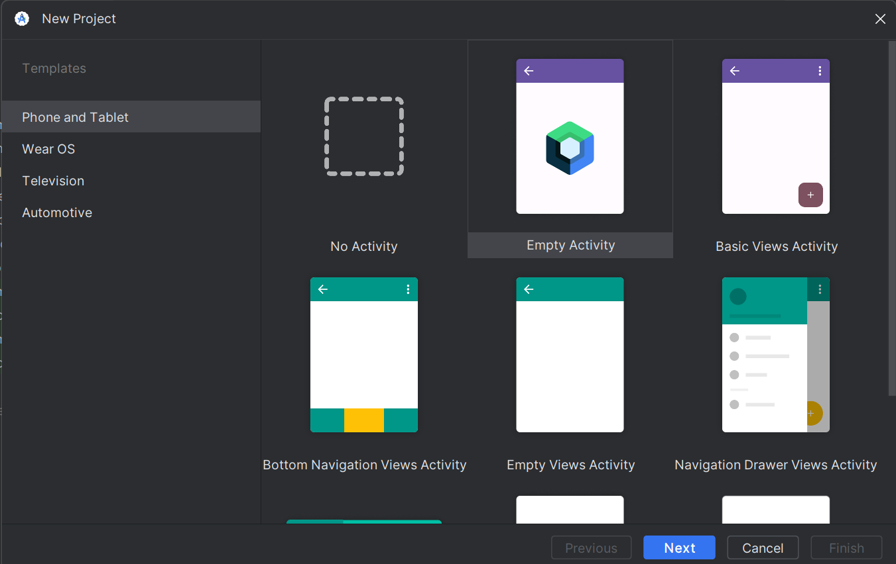
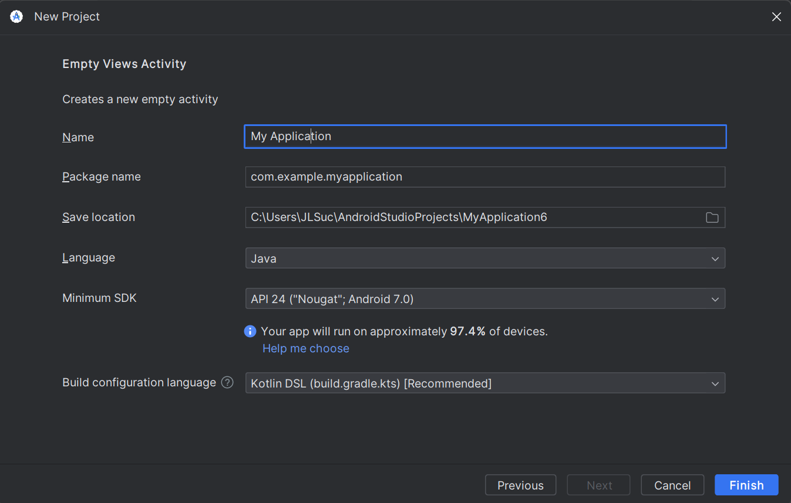

# Sesión 03 - Introducción a Android Studio
En esta sesion empezaremos a configurar e identificar la estructura de un proyecto básico de Android.

## 🎯 Objetivo

El alumno descargar Android Studio, configurará y conocerá el entorno de desarrollo Android. 

* También podrá crear nuevos proyectos en Android Studio. 

* El alumno se familiarizará con la interfaz de Android Studio. 

### Proyectos en clase

La primera vez que iniciamos Android Studio nos monstrará una pantalla de bienvenida parecida a la que tenemos aquí abajo.

1. Para empezar a crear un proyecto nuevo, seleccionamos la opcion **Start a new Android Studio Project**.
 

 2. A continuación elegimos el templete para nuestra apliación, en nuestro caso elegimos **“Empty Activity”**.
 
 ### **Nota:**

 Primero dominaremos los templetes básicos,posteriormente podrás intentar con otros estilos de templetes.
 

 3. Vamos a configurar nuestro proyecto.

    a. Ingresamos un nombre para nuestra apliación.

    b. Selecionar **Java** como lenguaje de la aplicación.

    c. En la opción Minimum API level, seleccionar el SDK: **Nougat**

4. Vamos a explorar las partes que conforman nuestro proyecto. Recuerda que aquí encontrarás la práctica.

[Práctica 01](Practica-01)

