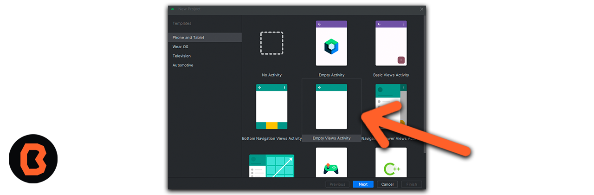
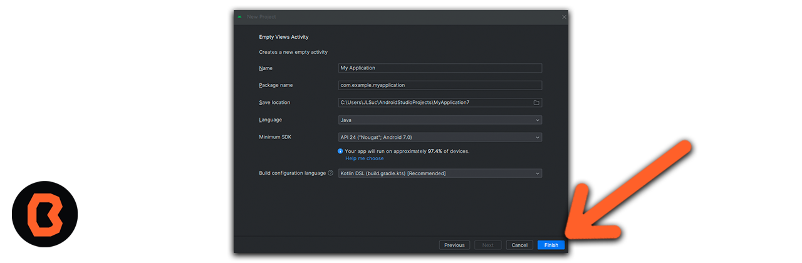
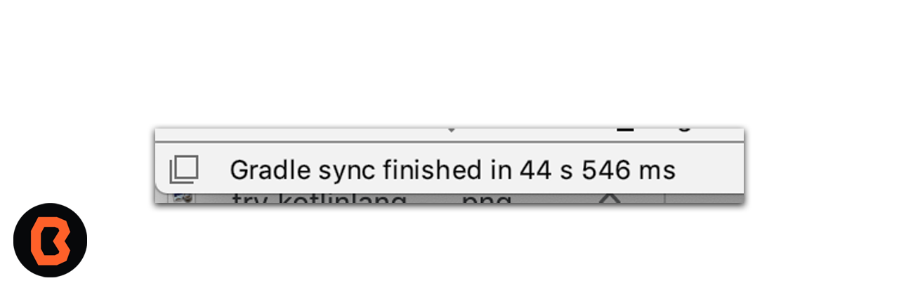

# Sesión 03 - Fundamentos Android e Introducción a Android Studio
En esta sesion empezaremos a configurar e identificar la estructura de un proyecto básico de Android.

## 🎯 Objetivo

Despúes de que descargaste Android Studio en esta sesión aprenderás como configurar tu entorno de desarrollo, crear nuevos proyectos y te vas a familiarizar con la interfaz de Android Studio.

### Proyectos en clase

La primera vez que iniciamos Android Studio nos monstrará una pantalla de bienvenida parecida a la que tenemos aquí abajo.

1. Para empezar a crear un proyecto nuevo, seleccionamos la opcion **Start a new Android Studio Project**.
* En Android Studio, una plantilla de proyecto es un proyecto de Android que proporciona el plano para un tipo de app determinado. Las plantillas crean la estructura del proyecto y los archivos necesarios de modo que Android Studio compile tu proyecto. Según la plantilla que elijas, te brindará un código inicial para que puedas avanzar más rápido.
 

 2. A continuación elegimos el templete para nuestra apliación, en nuestro caso elegimos **“Empty Activity”**.

 Haz clic en la plantilla **Empty Activity** para armar tu proyecto con ella. La plantilla Empty Compose Activity es la que permite crear un proyecto simple que puedes usar a fin de compilar una app de Compose. Tiene una sola pantalla y muestra el texto "Hello Android!"

 Primero dominaremos los templetes básicos,posteriormente podrás intentar con otros estilos de templetes.
 

 3. Vamos a configurar nuestro proyecto.

1. El campo Name se usa a fin de ingresar el nombre de tu proyecto. Para este tipo de codelab ingresa "Greeting Card".

2. Deja el campo Package name como está. Así se organizarán los archivos en la estructura de archivos. En este caso, el nombre del paquete será com.example.greetingcard.

3. Deja el campo Save location tal como está. Este contiene la ubicación en la que se guardan todos los archivos relacionados con tu proyecto. Toma nota de esa ubicación para encontrar tus archivos.

4. En el campo Language, selecciona **Java**.

5. Selecciona API 21: Android 5.0 (Lollipop) en el menú del campo Minimum SDK. Minimum SDK indica la versión mínima de Android en la que se puede ejecutar tu app.

6. La casilla de verificación Use legacy android.support libraries ya está desmarcada.

* Haz clic en Finish. Ese proceso puede tardar un poco, así que aprovecha para disfrutar de un rico té. Mientras se configura Android Studio, un mensaje y una barra de progreso indicarán si aún se está configurando tu proyecto. Es posible que se vea de este modo:

 

4. Vamos a explorar las partes que conforman nuestro proyecto. Recuerda que aquí encontrarás la práctica.

* Un mensaje similar a este te informará cuando se cree la configuración del proyecto.
 

[Práctica 01](Practica-01)

## 📝 Organización de la clase

- [Presentación - Sesión 03](presentacion/Sesion-03.pptx)

