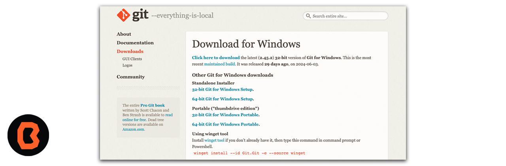
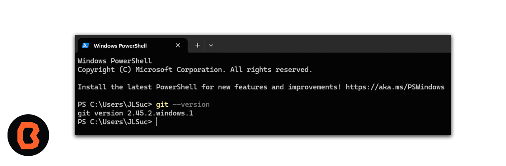
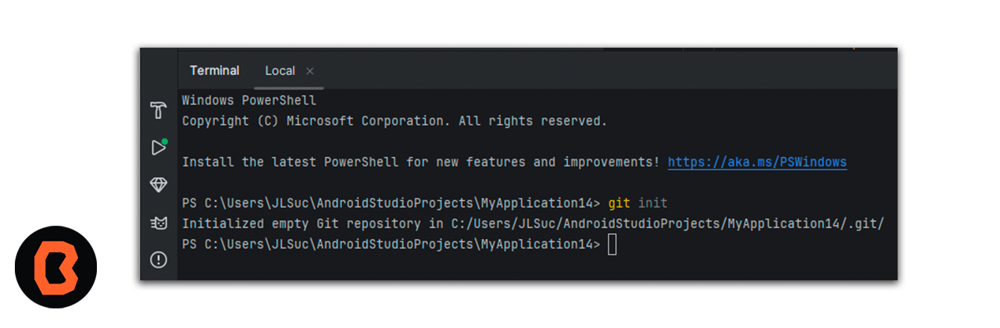
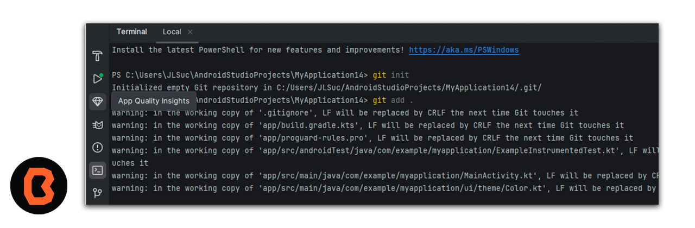
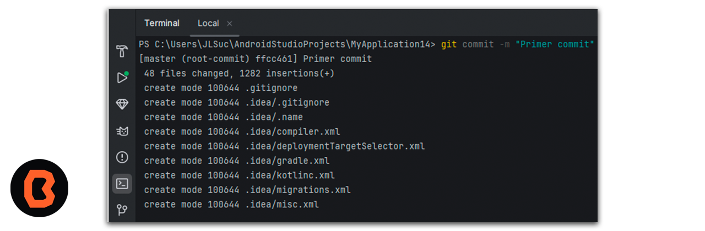

## Control de versiones

## Instalación

Abre tu navegador y accede al siguiente enlace <a href="https://git-scm.com/download/win">Descarga Git</a>
 y seecciona la opción de 64 bit

Ahora vamos a abrir una terminal desde nuestro escritorio y vamos a escribir git --version

