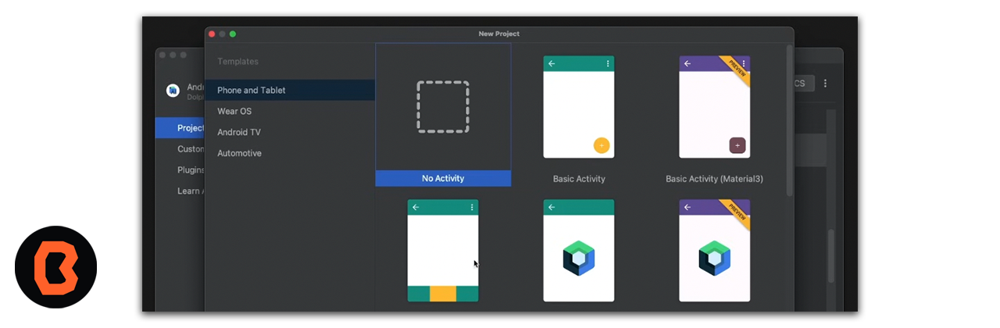
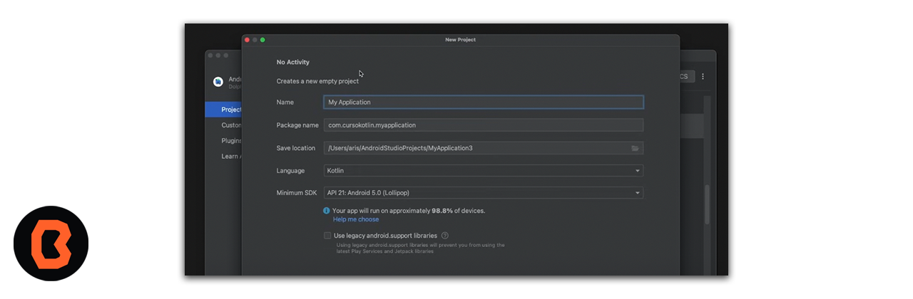
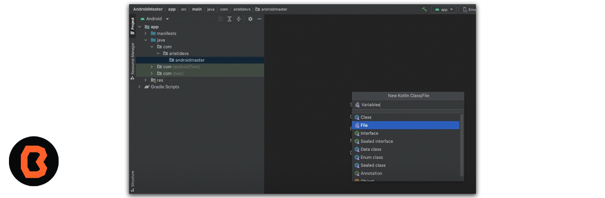

## Define y usa variables

* Cuando defines una variable, le asignas un nombre para identificarla de manera única. También debes decidir qué tipo de datos puede contener mediante la especificación del tipo de datos. Por último, puedes proporcionar un valor inicial que se almacenará en la variable, pero es opcional.

* Cada vez que tu código necesite acceder a la cantidad de mensajes no leídos, escribe count. Cuando ejecutas tus instrucciones, el compilador ve el nombre de la variable en tu código y usa el valor de la variable en su lugar.

## Crea un proyecto Nuevo

Tines que crear un proyecto nuevo, recuerda abrir Android Studio y en esta ocación crearemos un **No Activity** como se muestra a continuación

 

 Ahora tendremos que crear el proyecto y esperar a que los recursos cargen de forma correcta.

  

Tienes que crear un archivo de java llamado variables dentro de tu proyecto como se muestra a continuación.

  
