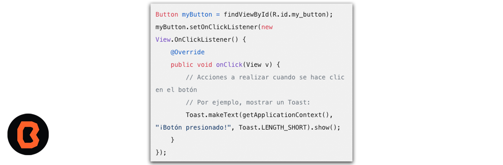

## Vinculación entre Java y XML 

Está vinculación es fundamental para trabajar con datos estructurados en aplicaciones Java. 

* DOM (Document Object Model) Parsers:
Los parsers DOM trabajan con todo el documento XML, cargándolo en memoria y construyendo una representación en forma de árbol. Esto permite acceder y manipular los elementos del XML.
* Ejemplo de generación de un documento XML desde Java con DOM:
JAXB (Java Architecture for XML Binding):
JAXB es una API que facilita la vinculación entre objetos Java y documentos XML. Puedes trabajar cómodamente con XML y JSON utilizando anotaciones de JAXB.

* JiBX, JAXB y XMLBeans son otras opciones para vincular datos en XML con objetos Java. Estas librerías te permiten generar código Java a partir de un esquema XML. Puedes elegir la que mejor se adapte a tus necesidades.

## OBJETIVOS 
 - Entender como es que Java y XML se combinan gracias al archivo R.java
 - Entender como es que modificando un objeto en Java, tiene impacto inmediato en la interfaz gráfica. 
 - Entender acerca de los onClickListener y como funcionan. 
 - Entender que pasa si se modifican propiedades de objetos con los ClickListeners. 

## Vinculación Java y XML
* La vinculación entre Java y XML es fundamental para trabajar con datos estructurados en aplicaciones Java. Aquí tienes algunas opciones para lograrlo:

    * Parsers DOM (Document Object Model):
    Los parsers DOM trabajan con todo el documento XML, cargándolo en memoria y construyendo una representación en forma de árbol. Esto permite acceder y manipular los elementos del XML. 

    * Ejemplo de generación de un documento XML desde Java con DOM: Ver video2.
    JAXB (Java Architecture for XML Binding):
    JAXB es una API que facilita la vinculación entre objetos Java y documentos XML. Puedes trabajar cómodamente con XML y JSON utilizando anotaciones de JAXB. 
    Librerías adicionales:

    * JiBX, JAXB y XMLBeans son otras opciones para vincular datos en XML con objetos Java. Estas librerías te permiten generar código Java a partir de un esquema XML. Puedes elegir la que mejor se adapte a tus necesidades. Más información aquí
    
- [Ejemplo 01](Ejemplo-01)

## Uso de OnClickListeners

En tu código Java, puedes asignar un OnClickListener a un botón de la siguiente manera:

Implementando View.OnClickListener en la actividad o fragmento:
Puedes hacer que tu actividad o fragmento implemente directamente la interfaz View.OnClickListener. Luego, sobrescribe el método onClick(View view) para manejar el evento de clic:

- Alterando propiedades con java y onClickListener	
	- [Ejemplo 03](Ejemplo-03)
	- [Reto 04](Reto-04)

## 📝 Organización de la clase

- [Práctica](Practica-06)
- [Presentación - Sesión 06](presentacion/Sesion-06.pptx)