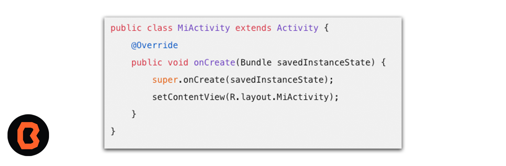
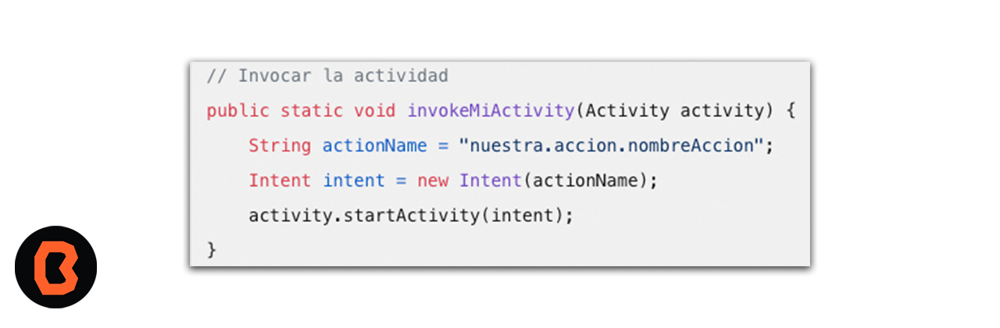

# Sesión 08 - Programación de Activities

## 🎯 Objetivo
- Aprenderás acerca de las llamadas a intent fuera de tu App hacia otras.
- Aprenderás a enviar correos electrónicos.
- Buscarás lugares con google maps desde tu App.
- Conectarás tu app Al servicio de llamadas de Android.

## Importancia de los Intents

Los intents en Android son objetos que nos permiten invocar componentes, como activities, services, broadcast receivers y proveedores de contenido. Básicamente, los intents nos ayudan a lograr lo siguiente:

1. Llamar a aplicaciones externas: Podemos usar intents para abrir otras aplicaciones desde la nuestra, como el navegador web o el marcador telefónico.
2. Lanzar eventos a los que otras aplicaciones puedan responder: Por ejemplo, podemos enviar un intent para compartir contenido en redes sociales o enviar un correo electrónico.
3. Lanzar alarmas: Si necesitamos programar una alarma o recordatorio, los intents nos permiten hacerlo.

Para usar intents, primero debemos registrar nuestras actividades en el archivo AndroidManifest.xml. Luego, podemos invocar esas actividades mediante un intent. Aquí tienes un ejemplo:

## Intent

Objetos que nos permiten invocar componentes

- [Ejercicio Intents](ejercicio-intents/README.md)

## Envío de correos electrónicos por Intent

 Es posible enviar correos electrónicos desde una aplicación creada en Android Studio. A continuación un ejemplo.

- [Ejercicio correos electrónicos ](ejercicio-correos/README.md)

## Búsqueda lugares con Google Maps
Puedes buscar lugares en Google Maps desde una aplicación creada en Android Studio

- [Ejercicio maps](ejercicio-maps/README.md)

## 📝 Organización de la clase

- [Ejercicio Intents](ejercicio-intents/README.md)
- [Ejercicio correos electrónicos ](ejercicio-correos/README.md)
- [Ejercicio maps](ejercicio-maps/README.md)
Presentación
- [Presentación - Sesión 08](presentacion/Sesion-08.pptx)

